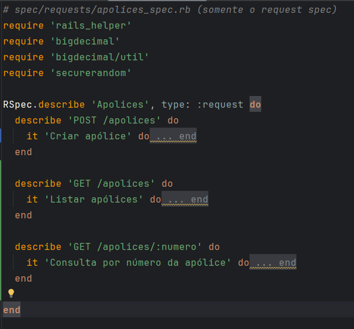
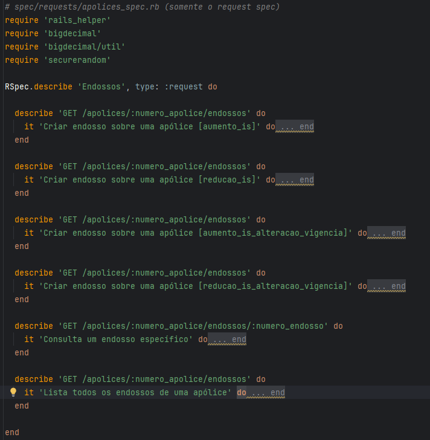
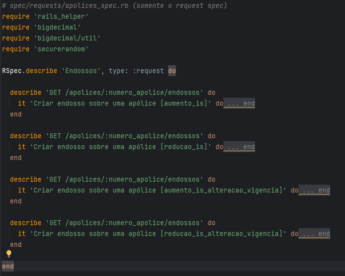
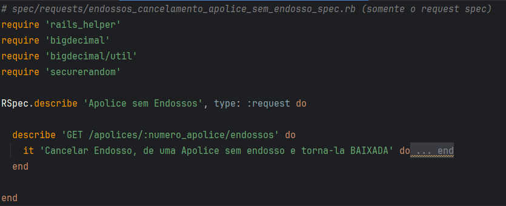
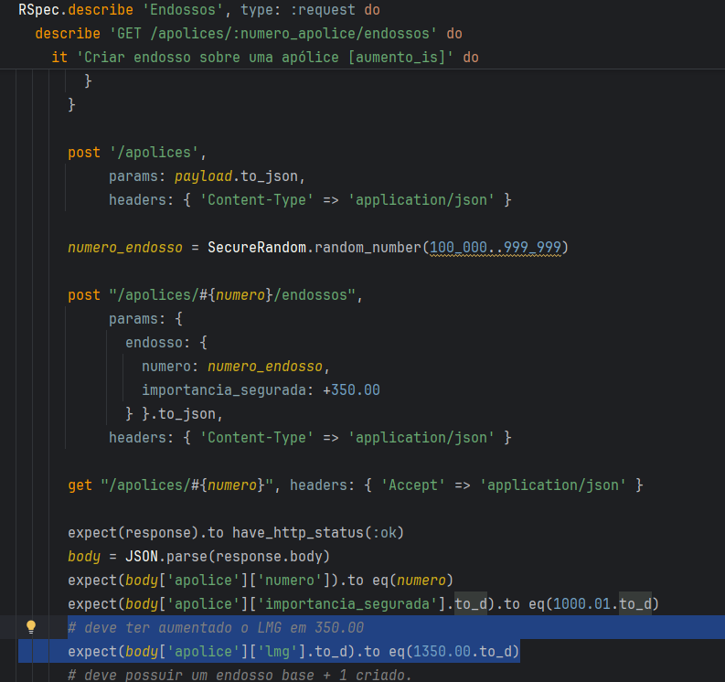
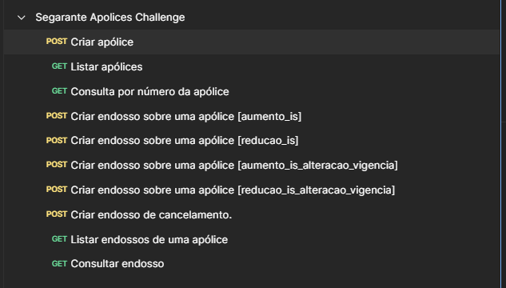
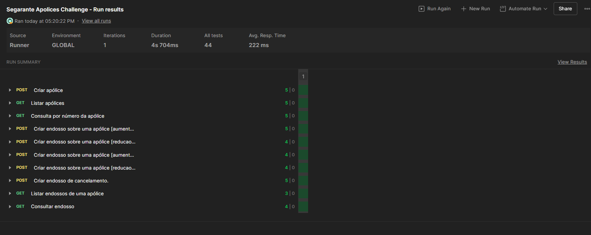

# 
Segarante - Backend Desafio 3

  <b>API de Apólices e Endossos</b>

---

## Contexto
Você deve implementar uma <b>API em Ruby on Rails (API-only)</b> para gerenciar <b>apólices de seguro</b> e seus <b>endossos</b>. 
O sistema deve permitir criar e consultar apólices e endossos, seguindo as regras de negócio descritas abaixo.

---

## Definições

### Apólice
A <b>apólice</b> representa o contrato de seguro firmado entre o segurado e a seguradora.

**Campos obrigatórios:**
- <code>numero</code> — identificador único da apólice
- <code>data_emissao</code> — data em que a apólice foi emitida
- <code>inicio_vigencia</code> — data de início da cobertura
- <code>fim_vigencia</code> — data de término da cobertura
- <code>importancia_segurada</code> — valor de referência original
- <code>lmg</code> — limite máximo de garantia (valor máximo atual de cobertura, após todos os endossos)

> A apólice deve sempre refletir os <b>dados vigentes</b>, considerando os endossos aplicados.

---

### Endosso
O <b>endosso</b> é uma alteração registrada em uma apólice existente.

**Campos esperados:**
- Data de emissão
- Tipo de endosso
- Valores e datas
- Relações de cancelamento, quando aplicável

> Endossos são <b>imutáveis</b>: não podem ser editados nem apagados.

---

## Tipos de Endosso
Os tipos de endosso devem ser determinados automaticamente a partir das diferenças entre os dados informados e os dados vigentes da apólice.

| Tipo                            | Descrição                               |
| ------------------------------- | ----------------------------------------|
| <b>aumento_is</b>                    | Aumenta a importância segurada (IS)     |
| <b>reducao_is</b>                    | Reduz a importância segurada (IS)       |
| <b>alteracao_vigencia</b>            | Altera o fim da vigência                |
| <b>aumento_is_alteracao_vigencia</b> | Aumenta a IS e altera o fim da vigência |
| <b>reducao_is_alteracao_vigencia</b> | Reduz a IS e altera o fim da vigência   |
| <b>cancelamento</b>                  | Cancela o último endosso válido         |

---

## Regras de Negócio

1. A <b>importância segurada (IS)</b> é o valor usado para atualizar o <b>LMG</b> da apólice. 
   Após cada endosso válido, o LMG deve refletir o valor vigente da IS.
2. O <b>tipo de endosso</b> deve ser determinado automaticamente com base nas diferenças entre os dados informados e os dados atuais da apólice.
3. Um <b>endosso de cancelamento</b> deve:
    - Cancelar o <b>último endosso válido</b> (não cancelado e que não seja de cancelamento).
    - Criar a relação de referência entre o endosso cancelado e o de cancelamento.
    - Caso o cancelamento torne a apólice inválida, a apólice deve ser marcada como <b>BAIXADA</b>.
4. Ao <b>consultar uma apólice</b>, a API deve retornar:
    - Todos os dados vigentes
    - O <b>LMG</b> atual após aplicação dos endossos válidos
    - O <b>status</b> atual (<code>ATIVA</code> ou <code>BAIXADA</code>)
5. <b>Apólices e endossos não podem ser apagados nem alterados.</b> 
   Apenas criação (<code>POST</code>) e consulta (<code>GET</code>) são permitidas.

---

## Funcionalidades Obrigatórias

### Apólices
- Criar apólice
- Consultar apólice com seus endossos
- Listar apólices

### Endossos
- Criar endosso sobre uma apólice
- Consultar endosso
- Listar endossos de uma apólice

---

## Regras Gerais
- Todos os campos obrigatórios devem ser validados.
- Validar campos:
  - LMG não pode ficar negativo
  - O fim da vigência não pode ser anterior ao início
  - O início da vigência pode ser no passado ou no futuro da data de emissão em no máximo 30 dias.
  - Outras validações que achar relevantes
- Não deve ser possível criar endossos inconsistentes (ex: vigência inválida).
- O histórico de endossos deve ser preservado integralmente.
- A aplicação deve garantir a integridade das referências entre endossos cancelados e canceladores.

---

## Testes Unitários
Deve ser entregue uma suíte de testes cobrindo os principais fluxos funcionais:

- Criação de apólice 
  
- Criação de endossos de todos os tipos 
  
- Cancelamento do endosso atual 
  
- Atualização do LMG e status da apólice 
- Cancelando endosso, de uma apólice que não possui. 
  
- Atualização do LMG 
  

---

## Postman
Deve ser entregue uma <b>collection do Postman</b> contendo:

- Todas as requisições necessárias para criar e consultar apólices e endossos 
  
- Automação entre as requisições 
  

---

## Docker
Deve ter um <code>dockerfile</code> e <code>docker_compose.yml</code> para rodar a aplicação localmente.

---

## Critérios de Avaliação

| Critério                 | Descrição                            |
| ------------------------ | ------------------------------------ |
| <b>Modelagem de dados</b>   | Correção e consistência das relações |
| <b>Regras de negócio</b>    | Implementação conforme as definições |
| <b>Testes automatizados</b> | Cobertura dos fluxos principais      |
| <b>Collection Postman</b>   | Completude e funcionamento           |
| <b>Clareza</b>              | Estrutura, nomeação e documentação   |

---

## Entrega
- O código deve ser entregue em um repositório público (<b>GitHub</b> ou <b>GitLab</b>).
- Incluir instruções de execução no <code>README.md</code>.
- Incluir a collection do Postman na raiz do projeto (<code>postman_collection.json</code>).
- O desafio deve estar funcional e testável.

---

